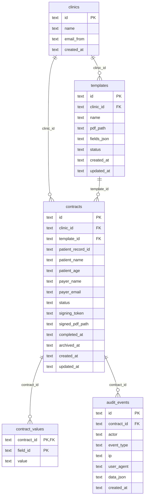

# Technical Overview

This document describes the current implementation in this repository. It is based on the checked-in code and configuration only. Unverified or missing areas are marked as uncertain.

## Architecture

Cardinal Contracts is a single Fastify application written in TypeScript.

- `src/server.ts` owns the HTTP server, route registration, request validation, static file serving, and workflow orchestration.
- `src/db.ts` opens the SQLite database with `better-sqlite3`, enables WAL mode and foreign keys, creates tables, inserts the default clinics, and exposes record types plus `fieldsFor()`.
- `src/pdf.ts` generates completed PDFs by stamping values and signature images onto the original template PDF with `pdf-lib`, then appending a signing certificate page.
- `src/email.ts` sends signing links through Resend when `RESEND_API_KEY` is configured.
- `src/audit.ts` writes audit events to SQLite.
- `public/index.html` and `public/main.js` implement the admin UI for clinics, templates, sending, and contract management.
- `public/sign.html` and `public/sign.js` implement the public signer flow.

The server exposes three static roots:

- `/` serves `public`.
- `/uploads/` serves uploaded template PDFs from `UPLOAD_DIR`.
- `/storage/` serves signed PDFs from `STORAGE_DIR`.

The frontend is not bundled. Admin PDF rendering loads PDF.js from a CDN in `public/main.js` and `public/index.html`.

## Current Feature Behaviour

### Clinics

The database bootstraps three clinics: `clinic_promis_hay_farm`, `clinic_promis_london`, and `clinic_cardinal`.

`GET /api/clinics` is public in the current server code. Creating and deleting clinics require the admin bearer token. Clinic deletion is blocked when templates or contracts reference the clinic.

### Templates

Admins upload PDFs with `POST /api/templates/upload`. Uploaded files are stored as `<template-id>.pdf` in `UPLOAD_DIR`; the template row stores the absolute PDF path.

Template fields are saved with `PUT /api/templates/:id/fields`. Supported field types are:

- `text`
- `number`
- `date`
- `signature`
- `checkbox`

Each field stores normalized page coordinates (`x`, `y`, `w`, `h`) between 0 and 1, a 1-based page number, a required flag, and an optional source mapping. Source mappings currently supported by the API are `patientName`, `patientAge`, `payerName`, `payerEmail`, and `manual`.

Saving fields from the admin UI sets the template status to `active`. Only active templates can be used to create contracts.

### Contract Creation And Sending

Admins create contracts with `POST /api/contracts`. The API validates the template, checks that it is active, checks that the clinic exists, creates a contract with status `pending`, and generates a unique signing token.

Fields mapped to patient or payer data are prefilled into `contract_values`.

The signing URL has this shape:

```text
{APP_URL}/sign.html?token={signing_token}
```

If `RESEND_API_KEY` is present, the application sends the signer an email through Resend. If it is absent, the response records `sent: false` with a reason and still returns the signing URL.

### Signing

The public signer flow loads contract data with `GET /api/sign/:token`. Archived contracts return HTTP 410. The route writes a `contract.opened` audit event every time it is called.

The signer submits values to `POST /api/sign/:token/complete`. The server rejects archived contracts, already completed contracts, and submissions missing required fields. On success it:

1. Upserts submitted values into `contract_values`.
2. Generates a signed PDF in `STORAGE_DIR`.
3. Sets contract status to `completed`.
4. Stores `signed_pdf_path` and `completed_at`.
5. Writes a `contract.completed` audit event.

The signer UI embeds the original uploaded PDF beside the generated form. The completed PDF is not shown to the signer by the current UI after signing; the admin dashboard links to it when `signed_pdf_path` exists.

### Archive And Removal

Admin contract listing defaults to active contracts (`archived_at IS NULL`). Passing `archived=true` lists archived contracts.

Archiving sets `archived_at` and blocks future signer access. Restoring clears `archived_at`. Permanent deletion is only allowed after archiving; deletion removes the contract row and, when present, the signed PDF file. Related field values and audit events are removed by `ON DELETE CASCADE`.

## API Flows

### Admin Authentication

Admin routes call `requireAdmin()` and expect:

```http
Authorization: Bearer <ADMIN_TOKEN>
```

The configured token defaults to `change-me` when `ADMIN_TOKEN` is not set.

### Template Setup Flow

1. `GET /api/clinics`
2. `POST /api/templates/upload`
3. Admin UI renders the uploaded PDF through `/uploads/<file>.pdf`.
4. `PUT /api/templates/:id/fields`
5. `GET /api/templates?clinicId=<clinic-id>`

### Contract Sending Flow

1. `POST /api/contracts`
2. Server pre-fills mapped fields in `contract_values`.
3. Server attempts to send email through Resend when configured.
4. API response includes the contract row, `signingUrl`, and email send result.

### Signer Completion Flow

1. `GET /api/sign/:token`
2. Signer fills fields in `public/sign.js`.
3. `POST /api/sign/:token/complete`
4. Server writes values, stamps the PDF, completes the contract, and records audit evidence.

### Contract Operations Flow

1. `GET /api/contracts?clinicId=<clinic-id>&archived=false`
2. `POST /api/contracts/:id/archive`
3. `GET /api/contracts?clinicId=<clinic-id>&archived=true`
4. `POST /api/contracts/:id/restore` or `DELETE /api/contracts/:id`
5. `GET /api/contracts/:id/audit`

## Database Relationships

SQLite is the only database used by the checked-in application code.



Relationship details:

- `templates.clinic_id`, `contracts.clinic_id`, and `contracts.template_id` are foreign keys without cascade delete.
- `contract_values.contract_id` cascades when a contract is deleted.
- `audit_events.contract_id` cascades when a contract is deleted.
- Template fields live as JSON in `templates.fields_json`, not in a separate table.
- `contract_values.field_id` has no foreign key because fields are JSON documents rather than rows.

## Known Technical Debt

These items are present in the code or build configuration.

- Authentication is a single shared admin bearer token; there are no user accounts, roles, sessions, or per-clinic admin permissions.
- `GET /api/clinics` is public.
- `ADMIN_TOKEN` defaults to `change-me` if not configured.
- Uploaded PDFs and signed PDFs are served as static files by filename under `/uploads/` and `/storage/`.
- Signing tokens do not expire in the current schema or route logic.
- There are no webhook callbacks to a patient-record system.
- There is no multi-signer routing or reminder workflow.
- Database migrations are handled inline in `src/db.ts`; only `contracts.archived_at` has an explicit additive migration check.
- `templates.fields_json` stores field definitions as JSON, so individual fields cannot be referenced by database constraints.
- Audit events are deleted when a contract is permanently deleted because of `ON DELETE CASCADE`.
- The test suite currently covers only the exported list of supported field types in `src/validation.ts`; route, PDF, database, email, and archive behaviours are not covered by tests.
- The signer UI does not restore an already captured signature image from saved values when reloading a partially completed contract.
- The admin frontend depends on CDN-hosted PDF.js at runtime.
- `create_cardinal_standard_room_template.sh` targets the external DocuSeal API, while this app is a separate self-hosted implementation. Keep that script distinct from this app's internal API flows.

## Deployment Assumptions

The repository includes a Dockerfile and `docker-compose.yml`.

The Docker image:

- Uses Node 22 on Debian Bookworm slim.
- Installs native build tooling for dependencies during install and build stages.
- Runs `npm run build`.
- Starts `node dist/src/server.js`.
- Exposes port `4321`.

The compose service:

- Runs one `cardinal-contracts` container.
- Maps host port `4321` to container port `4321`.
- Requires `ADMIN_TOKEN` to be set.
- Sets `DATABASE_PATH=/app/data/contracts.sqlite`.
- Sets `UPLOAD_DIR=/app/uploads`.
- Sets `STORAGE_DIR=/app/storage`.
- Mounts named volumes for `/app/data`, `/app/uploads`, and `/app/storage`.
- Optionally accepts `APP_URL`, `RESEND_API_KEY`, and `EMAIL_FROM`.

Operational assumptions visible in code and config:

- SQLite is used as the system of record.
- Uploaded template PDFs and generated signed PDFs must be persisted separately from the container filesystem.
- `APP_URL` must match the externally reachable base URL for email signing links to work.
- Resend is the only email provider implemented.
- A reverse proxy, TLS termination, backups, restore procedures, monitoring, and log retention are not defined in this repository.

## Uncertain Areas

- Clinical production compliance requirements are not described in this repository.
- Backup frequency, restore testing, and retention policy are not described in this repository.
- The intended production domain and TLS/proxy topology are not described in this repository.
- Whether signed PDFs should remain publicly reachable under `/storage/` or move behind admin authorization is not specified in this repository.
- Whether audit events should survive permanent contract deletion is not specified in this repository.
